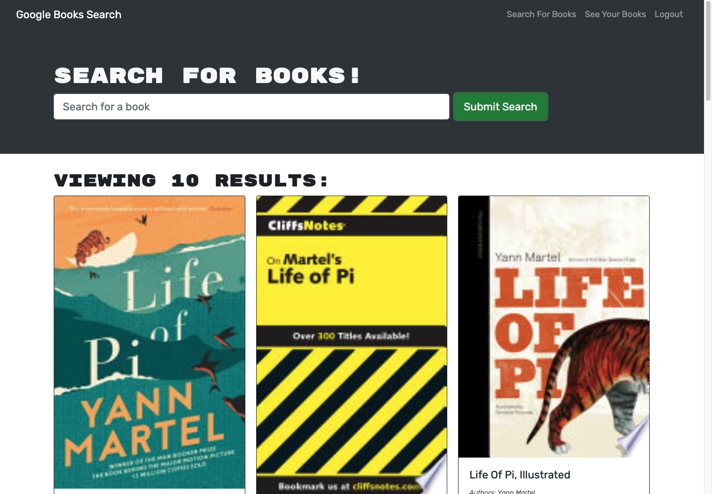
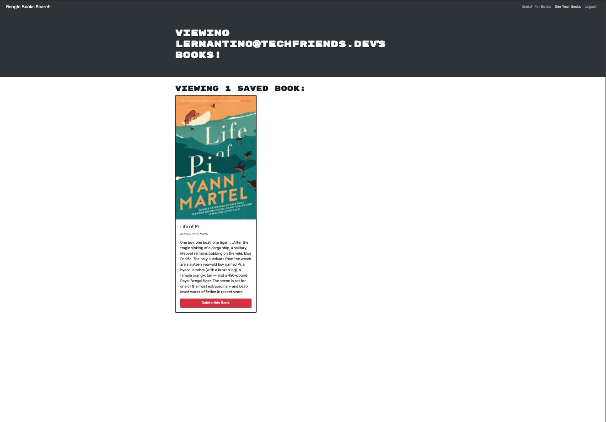
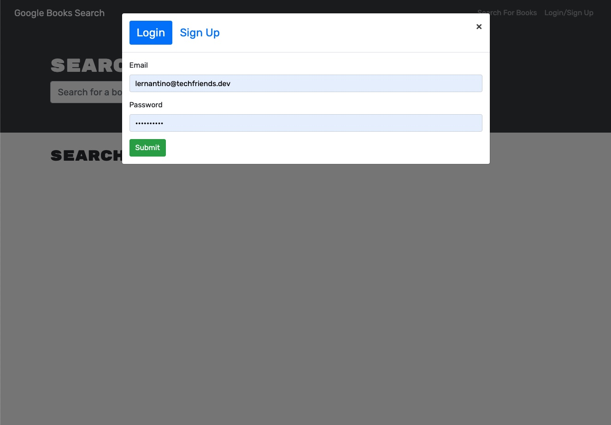

# Book-Search 


## Description

This app is a book-search app. It allows users to search for a book and save it to the account they signed up for. This app uses MERN to take in responses and create the desired output. The output is created using Google Books API search and everything is stored using Apollo.

## Table of Contents
  - [Table of Contents](#table-of-contents)
  - [Installation](#installation)
  - [Usage](#usage)
  - [Features](#features)
  - [License](#license)
  - [Contributing](#contributing)
  - [Screenshots](#screenshots)
  - [Questions](#questions)

## Installation
1. Clone this GitHub repository

2. Install all dependent npm packages

   ```
   npm install --save
   ```
3. Create a MongoDB database
5. If running on a server or hosting platform add the MONGODB_URI with connection string to the environment variables
6. run `npm run start:dev` outside of both client and server directories


## Usage
1. Run `npm run start:dev` to start the application
2. **Login/Signup** gets the user signed in.
3. **Search** allows the user to find their book.
4. **Save Book** allows the user to save the book to their account
5. **Logout** allows the user to logout
6. **See your Books** to see all of the books saved

A demo of the application is available at: 

## Features
* Log-in/sign-up
* Search book
* Save book
* See Books
* Logout

## License
This project uses the MIT license
## Screenshots - home
**Home Page**



## See your Books



## Log in



## Questions
Checkout my GitHub [profile](https://github.com/ryanpaynt)

Email me at: rpaynter@outlook.com